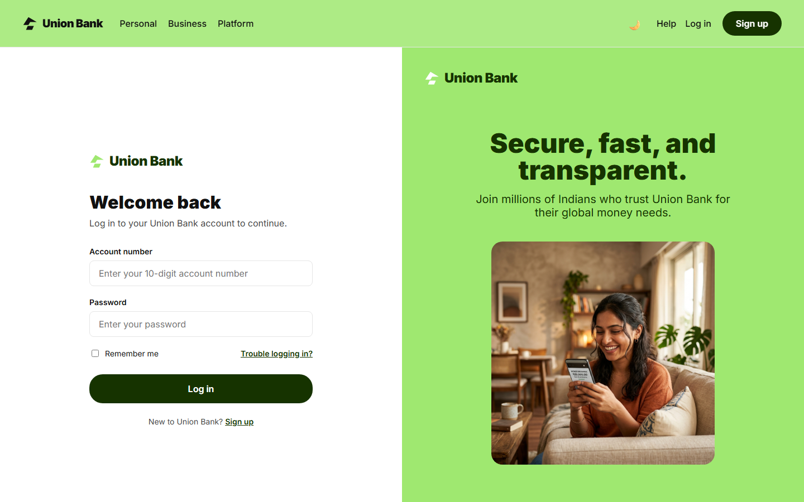

# 🏦 Union Bank Management System

<p align="center">
  <picture>
    <source media="(prefers-color-scheme: dark)" srcset="assets/logo-dark.svg" />
    
  </picture>
</p>

<p align="center">
  
  
  
  
  
  
  
  
</p>

<!--
  Social preview (maintainer note — invisible when rendered):
  GitHub does not use the README header image for the repo card. Upload one manually:
  Settings → General → Social preview → Edit → upload a 1280×640 (2:1) PNG under 1 MB.
  Good hero candidates, both already in this README: the dashboard capture in the 📸 Screenshots
  section, or the 🏗 architecture diagram. Re-upload to replace; GitHub caches the previous image.
-->

<p align="center">
  <em>A concurrent-safe banking API with atomic transactions, defense-in-depth security (JWT + TOTP 2FA + CSRF), async SQLAlchemy (SQLite/PostgreSQL), Prometheus observability, and 386 tests — built as a senior software engineering portfolio.</em>
</p>

<p align="center">
  <a href="#-what-this-demonstrates">What This Demonstrates</a> •
  <a href="#-architecture">Architecture</a> •
  <a href="#-engineering-case-studies">Case Studies</a> •
  <a href="#-quick-start">Quick Start</a> •
  <a href="#-metrics">Metrics</a> •
  <a href="docs/reference/SELF_AUDIT.md">Self-Audit</a>
</p>

---

## 📸 Screenshots

| | |
|---|---|
|  |  |
| *Marketing landing page* | *Customer login* |

> To add more: log in to the React app, capture your screen, save images to `docs/assets/screenshots/`, and reference them below.
>
> **Suggested additional screenshots:**
> - Customer dashboard with account balances and a completed transfer
> - TOTP 2FA enrollment and login flow
> - Grafana dashboard on Prometheus metrics (p95 latency, error rate)

---

## 📋 Table of Contents

- [What this demonstrates](#-what-this-demonstrates)
- [Architecture](#-architecture)
- [Engineering case studies](#-engineering-case-studies)
- [Quick start](#-quick-start)
- [Metrics](#-metrics)
- [Security](#-security)
- [Environment variables](#-environment-variables)
- [Testing](#-testing)
- [Continuous integration](#-continuous-integration)
- [Roadmap](#-roadmap)
- [Contributing](#-contributing)
- [Support](#-support)
- [License](#-license)

---

## What this demonstrates

A multi-interface banking system built to demonstrate senior-level engineering:

| Interface | Stack | Users |
| --- | --- | --- |
| CLI | Typer + Rich | Admin, Staff, Customers (local/offline) |
| Web Dashboard | React 19 + Vite SPA | Admin, Staff (browser-based) |
| REST API | FastAPI `/v1/` (50+ endpoints) | All clients, integrations |

The business logic is shared across all three interfaces through a single service layer, so each client remains thin and independently deployable.

## Architecture

```text
Union-Bank/
├── apis/                    # FastAPI REST service (v1)
│   ├── routes/              # Endpoints
│   ├── services/            # Shared business logic
│   ├── models/              # SQLAlchemy schemas
│   └── security/            # JWT, TOTP, CSRF
├── cli/                     # Typer CLI client
├── web/                     # React 19 + Vite SPA
├── db/                      # Alembic migrations + PostgreSQL adapter
├── workers/                 # Async task workers (Redis-backed)
├── tests/                   # pytest suite (386 tests)
├── docker-compose.yml
└── requirements.txt
```

## Engineering case studies

### Atomic transactions

The transfer/ledger paths use DB-level transactions with a compensating-rollback design. Fault-injection tests (`tests/test_atomicity.py`) intentionally trigger failures mid-write to prove that no partial state survives a crash or a failed transfer.

### Defense in depth

- **JWT** (RS256) for API authentication, with a short expiry and a refresh rotation
- **TOTP 2FA** for interactive login, with recovery codes
- **CSRF** protection on state-changing routes via double-submit cookies
- **Per-request idempotency keys** on money movements

### Observability

- Prometheus metrics (`/metrics`), structured with structlog
- OpenTelemetry tracing for the API and worker paths
- Slack/email alerts on failure-rate and p95-latency thresholds

## Quick start

### Prerequisites

- Python 3.11 or newer
- Docker & Docker Compose (for the production-like PostgreSQL + Redis stack)

### Option A — Local dev (SQLite, zero external services)

```bash
# 1. Clone the repository
git clone https://github.com/themanoj-025/Union-Bank.git
cd Union-Bank

# 2. Create and activate a virtual environment
python -m venv .venv
source .venv/bin/activate  # Windows: .venv\Scripts\activate

# 3. Install dependencies
pip install -r requirements.txt

# 4. Apply database migrations (SQLite dev DB)
alembic upgrade heads

# 5. Run the API
uvicorn apis.main:app --reload --port 8000
```

Open `http://localhost:8000/docs` for the Swagger UI.

### Option B — Full stack (PostgreSQL + Redis, with Docker)

```bash
# 1. Clone and copy the environment template
cp .env.example .env

# 2. Start the stack (API + DB + Redis + worker)
docker compose up --build

# The API is then available at http://localhost:8000
```

### Environment variables

| Variable | Default | Required | Description |
| --- | --- | --- | --- |
| `DATABASE_URL` | `sqlite:///./unionbank.db` | No | Dev: SQLite. Prod: PostgreSQL. |
| `DATABASE_URL_POSTGRES` | `postgresql+asyncpg://user:pass@db:5432/unionbank` | No | Production PostgreSQL connection |
| `REDIS_URL` | `redis://redis:6379/0` | No | Cache + worker broker |
| `JWT_SECRET` | — | Yes | JWT signing secret |
| `TOTP_SECRET` | — | Yes | TOTP issuer secret |
| `CSRF_SECRET` | — | Yes | CSRF token secret |
| `LOG_LEVEL` | `info` | No | Logging verbosity |
| `METRICS_PORT` | `9090` | No | Prometheus metrics port |

## Metrics

| Metric | Value |
| --- | --- |
| Automated tests | **386 passing** (`pytest tests/`) |
| API endpoints | 50+ (`/v1/`), documented in Swagger UI |
| Security controls | JWT (RS256) + TOTP 2FA + CSRF + idempotency |
| Observability | Prometheus + OpenTelemetry + structured logging |
| Database | Async SQLAlchemy over PostgreSQL (SQLite in dev) |

## Security

See [SECURITY.md](SECURITY.md) for the security model, and [docs/reference/SELF_AUDIT.md](docs/reference/SELF_AUDIT.md) for the latest self-audit.

> [!IMPORTANT] This is a portfolio project with a realistic-but-simplified threat model. Do not run it as a public-facing service against real money without a third-party security review.

## Testing

```bash
# Run the full suite
python -m pytest tests/ -v

# Run with coverage
python -m pytest tests/ -v --cov=apis --cov-report=term-missing
```

## Continuous integration

GitHub Actions runs:

- Lint + format (ruff, black)
- Typecheck (mypy)
- Unit + integration tests (386 tests)
- Security scans (bandit, gitleaks, dependency-audit)

## Roadmap

> [!CAUTION] Items marked with a checkbox are implemented. Items without a checkbox are tracked in the issue tracker — not built.

- [x] CLI + Web + REST API interfaces sharing one business layer
- [x] Atomic transfer transactions with fault-injection tests
- [x] JWT + TOTP 2FA + CSRF defense-in-depth
- [x] Prometheus observability + structured logging
- [ ] Multi-region failover (tracked public issue)

## Contributing

Contributions are welcome! Please see [CONTRIBUTING.md](CONTRIBUTING.md).

## Support

- 🐛 [Report a bug](https://github.com/themanoj-025/Union-Bank/issues)
- 💡 [Request a feature](https://github.com/themanoj-025/Union-Bank/issues)
- 📧 Email the maintainer via the issue tracker

## License

MIT License — see [LICENSE](LICENSE).

> [!IMPORTANT] The license in this README matches the `license` field in `pyproject.toml` and the contents of the `LICENSE` file. No conflicts were found.
