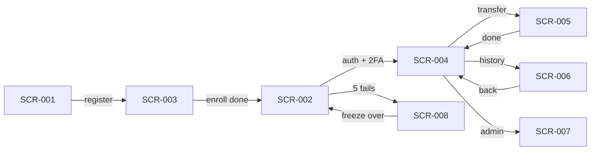
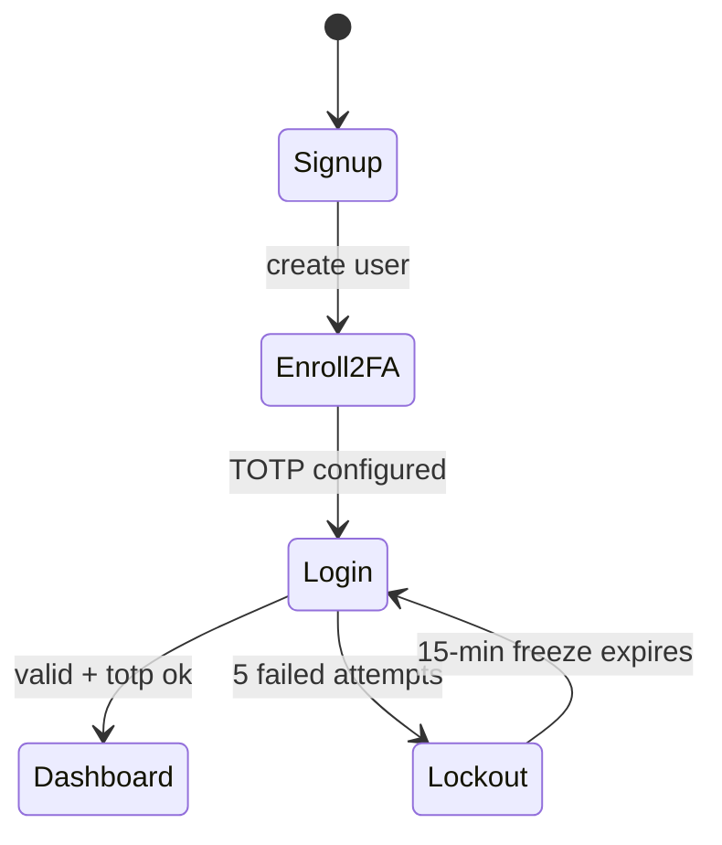
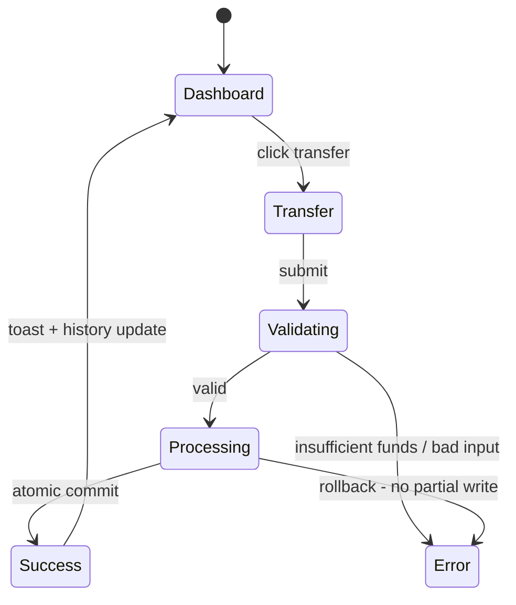

# AppFlow — UNION-BANK-: Application Flow

| Field | Value |
| --- | --- |
| Version | v0.1 |
| Last Updated | 2026-08-06 |
| Owner | Product Designer |
| Status | Approved |

---

## 1. Screen Inventory

| ID | Screen | Purpose | Entry | Exit | Auth |
| --- | --- | --- | --- | --- | --- |
| SCR-001 | Landing / Signup | Register account | /signup | Login | N |
| SCR-002 | Login | Authenticate + 2FA | /login | Dashboard | N |
| SCR-003 | 2FA Enrollment | Set up TOTP | post-signup | Login | Y |
| SCR-004 | Dashboard | Accounts overview | / | Transfer, deposit | Y |
| SCR-005 | Transfer | Move money between accounts | dashboard | Dashboard (result) | Y |
| SCR-006 | Transaction History | Paginated records | dashboard | Detail | Y |
| SCR-007 | Admin Dashboard | Stats + admin ops | /admin | Admin actions | Y (admin+2FA) |
| SCR-008 | Error / Lockout | Account frozen display | login fails | Re-login after freeze | N |

## 2. Navigation Map

## 3. Detailed Flow per Journey

### 3.1 Onboarding

### 3.2 Money Movement

## 4. Empty / Loading / Error States

| Screen | Empty | Loading | Error |
| --- | --- | --- | --- |
| SCR-001 | Form ready | Submit spinner | Field errors |
| SCR-002 | Form ready | Spinner | 401 message / lockout notice |
| SCR-004 | "No accounts" CTA | Skeleton | Banner + retry |
| SCR-005 | N/A | Processing indicator | Insufficient funds / 429 rate limit |
| SCR-006 | "No transactions" | Skeleton rows | Banner |
| SCR-007 | "No stats yet" | Chart spinners | Banner |
| SCR-008 | N/A | Countdown | Retry after freeze |

## 5. Edge Cases & Branching Logic

| IF | THEN |
| --- | --- |
| Transfer amount > balance | 400, no write |
| > 5 money ops in an hour (account) | 429 account-based rate limit |
| CSRF token missing/mismatch | 403 CSRF |
| Refresh token reused (rotation) | Revoke family, force re-login |
| Password changed | Invalidate all tokens (token versioning) |
| v1 endpoint called | Serve + deprecation header |
| Notification breaker open | Log, return success without notify |

## 6. Notifications & Re-engagement

- In-app: transfer success/error toasts; lockout countdown.
- No email/SMS (portfolio scope).

## 7. Cross-Platform Deltas

- React SPA targets desktop browsers; responsive basics apply.
- API is mobile-consumable; no native apps.

## 8. Related Documents

| Document | Relationship |
| --- | --- |
| [PRD.md](../product/PRD.md) | Journeys to user stories |
| [Design.md](Design.md) | Component usage |
| [API.md](../technical/API.md) | Endpoints per screen |
| [SecurityAndCompliance.md](../technical/SecurityAndCompliance.md) | Lockout/CSRF rules |
