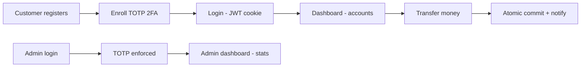

# PRD — UNION-BANK-: Concurrent-Safe Banking API & Management System

| Field | Value |
| --- | --- |
| Version | v0.1 |
| Last Updated | 2026-08-06 |
| Owner | Product Manager |
| Status | Approved |

---

## 1. Executive Summary

UNION-BANK- is a production-grade, concurrent-safe banking API and management system built as a senior software-engineering portfolio. It demonstrates five senior-level skills with real evidence: atomic financial transactions under concurrency (crash-mid-transfer fault injection proves no partial write), defense-in-depth security (RS256 JWT, TOTP 2FA, httpOnly cookies, CSRF double-submit, account-based rate limiting), an async migration strategy, database evolution at scale (SQLite→PostgreSQL via Alembic, SQL cursor pagination), and production observability (Prometheus, structured JSON logs, health/readiness probes, Grafana, Kubernetes manifests). The system includes a FastAPI backend, a React 19 SPA, 386 tests at 73% coverage, and dual audits scoring it 8.1/10.

## 2. Problem Statement

- **User pain (end users):** Banking operations must be all-or-nothing — a crash between debit and credit destroys money; users need secure, correct money movement.
- **User pain (portfolio consumers):** Interviewers and collaborators need *proof* of senior engineering skills, not claims. Generic projects fail to demonstrate concurrency safety, defense-in-depth, and production readiness.
- **Cost of not solving it:** Undifferentiated portfolio; no demonstrable answers for "how do you handle a crash mid-transfer?" or "how do you secure a banking API?"

## 3. Goals & Non-Goals

| Goal | Metric | Target |
| --- | --- | --- |
| Atomic transfers | Crash-mid-transfer test | No partial write survives (passing) |
| Money conservation | Concurrency test (10 parallel transfers) | No lost updates / no double-spend |
| Security depth | Security test families | SQLi, XSS, CSRF, JWT tamper, password-leak all pass |
| Test coverage | Backend coverage | ≥ 73% (current), target 80% |
| Reliability | Test suite green | 386 passing (376 backend + 10 frontend) |
| Observability | Request/error/latency metrics | 100% of requests logged + metered |

**Non-Goals (v1):**

- No real money, real users, or production financial licensing (portfolio/educational).
- No read-replica topology (documented as 10x-scale path).
- No hash-linked append-only audit (documented as 10x-scale path).
- No TLA+ formal verification (documented as 10x-scale path).
- No mobile app (React SPA only).

## 4. Target Users & Personas

| Persona | Role | Goals | Frustrations | Quote | Tech Level |
| --- | --- | --- | --- | --- | --- |
| Interviewer — Senior eng hiring | Technical interviewer | See proof of concurrency, security, scale thinking | Projects with claims but no evidence | "Show me the crash test." | High |
| Collaborator — Reviewer | Code reviewer / contributor | Understand architecture, run tests | Dead code, ambiguous structure | "Where is the live code?" | High |
| Dev — Learner | Junior engineer studying the repo | Learn senior patterns | Opaque magic | "Why begin_nested() here?" | Medium |
| Admin — Demo user | Evaluator running demo | Manage accounts/loans safely | Insecure defaults | "Can I run it in 10 minutes?" | Medium |

## 5. User Stories

| ID | As a... | I want... | So that... | Priority | Acceptance Criteria |
| --- | --- | --- | --- | --- | --- |
| US-001 | Customer | To register and log in with 2FA | My account is protected | P0 | Register → enroll TOTP → login enforced for admin |
| US-002 | Customer | To transfer money between accounts | Funds move atomically | P0 | Transfer succeeds; crash test proves atomicity |
| US-003 | Customer | To deposit/withdraw safely | My balance stays consistent | P0 | All-or-nothing operations |
| US-004 | Admin | To log in with TOTP 2FA | Admin actions are gated | P0 | TOTP enforced on admin login |
| US-005 | Customer | To view account stats cached fast | Admin stats load quickly | P1 | Redis cache with invalidate-on-write |
| US-006 | API consumer | To use a versioned, envelope API | I migrate predictably | P1 | /api/v2 envelope with deprecation headers on v1 |
| US-007 | Operator | To see health/readiness/metrics | I can run it in production | P1 | /health, /ready, /metrics endpoints |

## 6. Feature List

**Epic: Money Movement**

| ID | Feature | Description | Priority | Status |
| --- | --- | --- | --- | --- |
| REQ-001 | Atomic transfer | begin_nested() savepoint; fault-injection proven | P0 | Live |
| REQ-002 | Deposit / withdraw | All-or-nothing balance ops | P0 | Live |
| REQ-003 | Transaction history | Paginated (cursor) records | P1 | Live |
| REQ-004 | Idempotency | Duplicate-safe operations per ADR-0004 | P1 | Live |

**Epic: Security**

| ID | Feature | Description | Priority | Status |
| --- | --- | --- | --- | --- |
| REQ-010 | RS256 JWT auth | 15-min access via httpOnly cookies | P0 | Live |
| REQ-011 | Refresh rotation | 7-day rotating refresh tokens, bcrypt-hashed | P0 | Live |
| REQ-012 | TOTP 2FA | pyotp enrollment + admin enforcement | P0 | Live |
| REQ-013 | CSRF double-submit | Cookie + header pattern on state changes | P0 | Live |
| REQ-014 | Rate limiting | Account-based (5 money ops/hr) + IP-based | P0 | Live |
| REQ-015 | Account lockout | 5 fails → 15-min freeze | P1 | Live |
| REQ-016 | Security headers | HSTS, CSP, X-Frame-Options, etc. | P1 | Live |

**Epic: Data & Scale**

| ID | Feature | Description | Priority | Status |
| --- | --- | --- | --- | --- |
| REQ-020 | Async SQLAlchemy | Hot paths async; protocol-based DI | P0 | Live |
| REQ-021 | Alembic migrations | SQLite↔PostgreSQL evolution | P0 | Live |
| REQ-022 | Cursor pagination | Flat memory 100→10k accounts | P1 | Live |
| REQ-023 | Redis caching | 60s TTL + invalidate-on-write | P1 | Live |

**Epic: Ops**

| ID | Feature | Description | Priority | Status |
| --- | --- | --- | --- | --- |
| REQ-030 | Prometheus metrics | Rate, error rate, p95, cache hit ratio | P1 | Live |
| REQ-031 | Structured JSON logs | bank.jsonl output | P1 | Live |
| REQ-032 | Health/readiness probes | Liveness + readiness endpoints | P1 | Live |
| REQ-033 | K8s + Grafana manifests | Production deployment artifacts | P2 | Live |

**Epic: Frontend**

| ID | Feature | Description | Priority | Status |
| --- | --- | --- | --- | --- |
| REQ-040 | React 19 SPA | Auth, dashboard, transfers | P1 | Live |
| REQ-041 | Axios cookie/CSRF client | httpOnly cookies + CSRF header | P1 | Live |

## 7. User Journeys (high level)

## 8. Success Metrics / KPIs

| Metric | Target | Measurement |
| --- | --- | --- |
| North star: demonstration value | 8.1/10 audit (from 3.8) | [SELF_AUDIT.md](../reference/SELF_AUDIT.md) |
| Test suite health | 386 passing, never regress | CI |
| Coverage | 73% → 80% | pytest --cov |
| Concurrency correctness | 10-transfer conservation | ThreadPoolExecutor test |
| Security tests | All families green | CI security jobs |

## 9. Assumptions & Dependencies

- Python 3.11+, Node 20+, PostgreSQL 16 / SQLite, Redis 7.2.
- Portfolio/educational scope — not a regulated financial product.
- CI (10 jobs) enforces quality; docker-compose.prod.yml for live demo.
- Known gap: `pybreaker` dependency missing from local env (see ../project/Tracker.md blocker) — documented, fixes tests/test_integration.py import.

## 10. Risks

Top risks from ../project/RiskRegister.md:

1. **Local env dependency gap (R-01):** `pybreaker` missing → 3 test modules fail locally (CI unaffected). Fix: add to requirements + reinstall.
2. **SQLite write serialization (R-02):** Transfers serialize under high concurrency — mitigated by documented PostgreSQL path.
3. **Portfolio scope creep (R-07):** Adding financial features without regulation — mitigated by strict non-goals.

## 11. Release Criteria (v1 done)

- [ ] All 386 tests pass in CI (10 jobs)
- [ ] Crash-mid-transfer fault injection test green
- [ ] 10-parallel-transfer money conservation test green
- [ ] Security suite green (SQLi/XSS/CSRF/JWT/2FA/rate-limit)
- [ ] `/api/v2` envelope API documented; v1 deprecation headers present
- [ ] Observability endpoints live (metrics, health, ready, logs)
- [ ] README quick-start works in < 15 min

## 12. Open Questions

| # | Question | Owner | Resolve By |
| --- | --- | --- | --- |
| OQ-01 | Add TLA+ spec of transfer atomicity (10x path)? | Owner | 2026-12-01 |
| OQ-02 | Migrate to read replicas via DI config only? | Owner | 2026-11-01 |
| OQ-03 | Push coverage to 80%? | Owner | 2026-10-01 |

## 13. Related Documents

| Document | Relationship |
| --- | --- |
| [TechSpec.md](../technical/TechSpec.md) | Architecture & stack |
| [AppFlow.md](../design/AppFlow.md) | Screens/journeys |
| [Design.md](../design/Design.md) | React SPA design system |
| [Schema.md](../technical/Schema.md) | Data model |
| [ImplementationPlan.md](../project/ImplementationPlan.md) | Phase plan |
| [Tracker.md](../project/Tracker.md) | Live status incl. pybreaker blocker |
| [Rules.md](../project/Rules.md) | Standards & CI gates |
| [API.md](../technical/API.md) | v1/v2 endpoint contracts |
| [SecurityAndCompliance.md](../technical/SecurityAndCompliance.md) | Threat model, 2FA, CSRF detail |
| [Testing.md](../technical/Testing.md) | 386-test strategy |
| [Deployment.md](../technical/Deployment.md) | Docker/K8s/Grafana |
| [Glossary.md](../reference/Glossary.md) | Vocabulary |
| [RiskRegister.md](../project/RiskRegister.md) | Full register |
