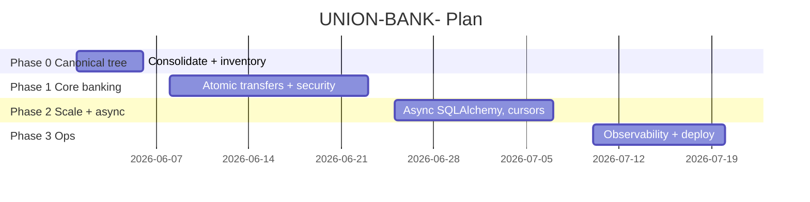
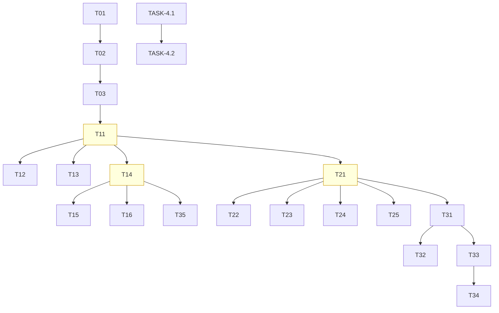

# ImplementationPlan — UNION-BANK-: Phased Build Plan

| Field | Value |
| --- | --- |
| Version | v0.1 |
| Last Updated | 2026-08-06 |
| Owner | Tech Lead |
| Status | Approved |

---

## 1. Build Philosophy

Evidence-driven vertical slices: every phase ends with proof artifacts (tests, ADRs, audit scores). Correctness and security ship with each slice, never as an afterthought.

## 2. Phase Overview

> Status: Phases 0–3 historically complete (audit 8.1/10). Remaining work is hardening + open questions — see Tracker.md.

## 3. Phase Breakdown

### Phase 0 — Canonical Tree (COMPLETE)

**Goal:** One unambiguous codebase. **Exit:** ../reference/INVENTORY.md with 0 AMBIGUOUS entries.

| TASK | Description | Depends | Owner | Effort | Maps to |
| --- | --- | --- | --- | --- | --- |
| TASK-0.1 | Forensic inventory (import-graph) | — | Owner | 3d | [INVENTORY.md](../reference/INVENTORY.md) |
| TASK-0.2 | Delete dead code | TASK-0.1 | Owner | 1d | ADR-0001 |
| TASK-0.3 | Service-layer consolidation | TASK-0.2 | Owner | 2d | ADR-0001 |

### Phase 1 — Core Banking (COMPLETE)

**Goal:** Atomic, secure money movement. **Exit:** Crash + concurrency + security tests green.

| TASK | Description | Depends | Owner | Effort | Maps to |
| --- | --- | --- | --- | --- | --- |
| TASK-1.1 | begin_nested() transfer | TASK-0.3 | Owner | 2d | REQ-001 |
| TASK-1.2 | Fault-injection crash test | TASK-1.1 | Owner | 2d | REQ-001 |
| TASK-1.3 | Concurrency conservation test | TASK-1.1 | Owner | 1d | REQ-001 |
| TASK-1.4 | Security hardening | TASK-1.1 | Owner | 5d | REQ-010..016 |
| TASK-1.5 | 2FA completion | TASK-1.4 | Owner | 2d | REQ-012, ADR-0003 |
| TASK-1.6 | Rate limiting + lockout | TASK-1.4 | Owner | 2d | REQ-014, REQ-015 |

### Phase 2 — Scale & Async (COMPLETE)

**Goal:** Async hot paths + flat-memory pagination. **Exit:** 10k-account cursor test green.

| TASK | Description | Depends | Owner | Effort | Maps to |
| --- | --- | --- | --- | --- | --- |
| TASK-2.1 | Async SQLAlchemy hot paths | TASK-1.3 | Owner | 3d | REQ-020 |
| TASK-2.2 | Protocol-based DI | TASK-2.1 | Owner | 2d | REQ-020 |
| TASK-2.3 | Cursor pagination | TASK-2.1 | Owner | 2d | REQ-022 |
| TASK-2.4 | Redis cache + invalidate | TASK-2.1 | Owner | 2d | REQ-023 |
| TASK-2.5 | Alembic SQLite↔Postgres | TASK-2.1 | Owner | 3d | REQ-021, ADR-0005 |

### Phase 3 — Ops (COMPLETE)

**Goal:** Production readiness. **Exit:** Probes + metrics + K8s manifests live.

| TASK | Description | Depends | Owner | Effort | Maps to |
| --- | --- | --- | --- | --- | --- |
| TASK-3.1 | Prometheus /metrics | TASK-2.4 | Owner | 2d | REQ-030 |
| TASK-3.2 | JSON logging | TASK-3.1 | Owner | 1d | REQ-031 |
| TASK-3.3 | Health/readiness probes | TASK-3.1 | Owner | 1d | REQ-032 |
| TASK-3.4 | Grafana + K8s manifests | TASK-3.3 | Owner | 3d | REQ-033 |
| TASK-3.5 | React SPA + Vitest | TASK-1.4 | Owner | 5d | REQ-040/041 |

### Phase 4 — Hardening (OPEN)

**Goal:** Close known gaps. **Exit:** Coverage 80%, env fix verified.

| TASK | Description | Depends | Owner | Effort | Maps to |
| --- | --- | --- | --- | --- | --- |
| TASK-4.1 | Fix local `pybreaker` dep gap | — | Owner | 0.5d | Tracker R-01 |
| TASK-4.2 | Coverage 73→80% | TASK-4.1 | Owner | 3d | PRD KPI |
| TASK-4.3 | TLA+ atomicity spec (explore) | — | Owner | 5d | OQ-01 |
| TASK-4.4 | Read-replica DI config | — | Owner | 2d | OQ-02 |

## 4. Dependency Graph

## 5. Environment & Tooling Setup Checklist

- [ ] Python 3.11+ venv; `pip install -e .` + `requirements.txt` (includes pybreaker — TASK-4.1)
- [ ] `npm install` in frontend
- [ ] Redis + PostgreSQL (or SQLite for dev)
- [ ] pre-commit hooks installed
- [ ] Verify `make lint`, `make test`, `npm test` (frontend)
- [ ] `docker compose -f docker-compose.prod.yml up` for demo

## 6. Rollout Strategy

- v1 deprecation: served with `Deprecation` header; removal after v2 maturity (API.md policy).
- DB: Alembic upgrade before deploy; rollback = downgrade (round-trip tested).
- Feature flags: none in v1 — rely on versioned API + config.

## 7. Definition of Done (global)

- [ ] Tests passing (backend + frontend) and coverage gate met
- [ ] Security gates green (SQLi/XSS/CSRF/JWT/2FA/rate-limit)
- [ ] Docs updated (Schema.md/../technical/API.md/../technical/SecurityAndCompliance.md as applicable)
- [ ] commitlint + ruff/prettier clean
- [ ] Tracker.md updated
- [ ] PR ≤ 400 lines unless justified

## 8. Related Documents

| Document | Relationship |
| --- | --- |
| [PRD.md](../product/PRD.md) | REQ IDs traced |
| [AppFlow.md](../design/AppFlow.md) | SCR IDs traced |
| [Schema.md](../technical/Schema.md) | TBL IDs traced |
| [Tracker.md](Tracker.md) | Live status incl. Phase 4 |
