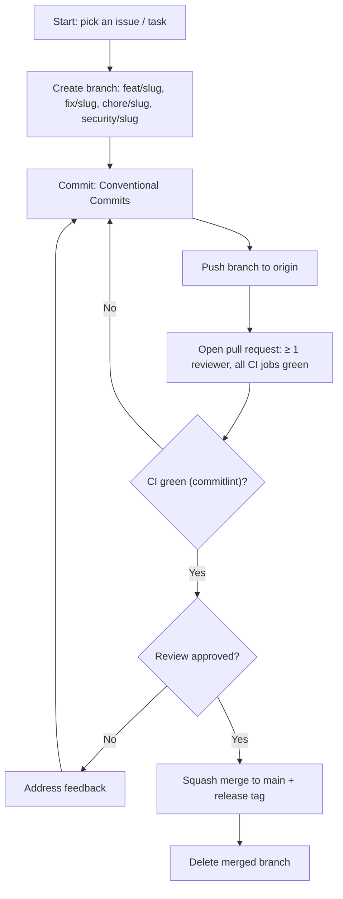

# Rules — UNION-BANK-: Coding Standards & AI-Agent Operating Rules

| Field | Value |
| --- | --- |
| Version | v0.1 |
| Last Updated | 2026-08-06 |
| Owner | Staff Engineer |
| Status | Approved |

---

## 1. Guiding Principles

1. **Financial correctness first** — every money path is atomic and tested for crashes.
2. **No silent failures** — `except: pass` banned by CI grep; all errors logged with context.
3. **One canonical tree** — exactly one copy of every module; zero ambiguity (INVENTORY.md).
4. **Domain purity** — `domain/` imports only domain + stdlib.
5. **Defense in depth** — security at every layer, each independently testable.
6. **Invariant tests over example tests** — assert properties (money conservation) not just outputs.
7. **Small PRs** ≤ 400 lines; CI 10 jobs must pass.

## 2. Code Style

- **Languages:** Python 3.11+ (backend), TypeScript/React 19 (frontend).
- **Lint/format:** ruff + black-compatible backend; ESLint/Prettier frontend.
- **Naming:** snake_case (py), camelCase (TS), `UPPER_CASE` constants.
- **Structure (canonical):**

```
UNION-BANK-/
├── src/unionbank/
│   ├── domain/            # pure domain (no outside imports)
│   ├── application/       # services + interfaces (protocols)
│   ├── infrastructure/    # repositories, cache, logging, DI container
│   ├── entrypoints/api/   # FastAPI app, v1 + v2 routers
│   └── utils/             # analyzr, helpers
├── frontend/              # React 19 + Vite
├── tests/                 # 376 backend tests
├── docs/                  # ADRs, INVENTORY, THREAT_MODEL, RUNBOOK
├── migrations/            # Alembic
├── scripts/
└── docker-compose*.yml, k8s/
```

## 3. Git Workflow

- Branches: `feat/<slug>`, `fix/<slug>`, `chore/<slug>`, `security/<slug>`.
- Commits: Conventional Commits (commitlint enforced).
- PRs: ≥ 1 reviewer, all CI jobs green, squash merge; releases tagged.
- Never force-push main; ADR-0006 defines release strategy.

## 4. Testing Requirements

- Coverage gate: ≥ 73% (target 80%) on core paths.
- MUST have: atomicity fault-injection, concurrency conservation, security families (SQLi/XSS/CSRF/JWT/2FA), migration round-trips, property-based invariants.
- Optional: mutation testing (mutmut), OpenAPI fuzzing (schemathesis) — both run in CI.
- Frontend: Vitest + React Testing Library for states.

## 5. AI Agent Operating Rules

- Read Tracker.md and ImplementationPlan.md before starting a task.
- Never mark a task 🟢 Done without the relevant tests passing (local or CI).
- Never invent requirements not in ../product/PRD.md/../technical/TechSpec.md — flag ambiguity instead of guessing.
- Any schema change → same-PR update to ../technical/Schema.md + Alembic migration.
- Any API change → same-PR update to ../technical/API.md (v1/v2 envelope).
- Never commit secrets; use env vars per ../technical/SecurityAndCompliance.md.
- Never weaken security tests to make them pass — fix the code.
- Preserve domain purity: no infra imports into `domain/`.
- When a rule conflicts with a request, state the conflict rather than silently picking one.

## 6. Security Baseline Rules

- All state-changing requests require CSRF double-submit (cookie + header).
- Tokens in httpOnly, Secure, SameSite=Strict cookies — never localStorage.
- Refresh tokens bcrypt-hashed at rest; rotated per use; 7-day TTL.
- TOTP enforced for admin login; enrollment mandatory path.
- Rate limits: account-based (5 money ops/hr) + IP-based on all endpoints.
- Parameterized queries only; no raw SQL string concat.
- Input validation via Pydantic; SQLi/XSS fixtures in test suite.

## 7. Documentation Rules

- Migration → ../technical/Schema.md + ADR if behavioral.
- API contract change → ../technical/API.md.
- New security control → ../technical/SecurityAndCompliance.md + ../reference/THREAT_MODEL.md.
- Dead-code removal → keep ../reference/INVENTORY.md current.

## 8. Prohibited Patterns

| Pattern | Why |
| --- | --- |
| `except: pass` | Silent failure — violates Principle 2 |
| Tokens in localStorage | XSS exfiltration |
| Raw SQL concat | Injection |
| Balance updates without row lock/savepoint | Lost updates |
| Editing applied migrations | Breaks history |
| Non-envelope responses in v2 | Breaks API contract |
| Committing secrets/.env | Leak |

## 9. Escalation Rules

**Ask a human:**
- Changing the atomicity contract (savepoint strategy).
- Weakening security controls or test gates.
- Deleting financial records or migrations.
- Adding new money-movement semantics.

**Decide autonomously:**
- Refactors with invariant tests green.
- Adding observability/metrics.
- Bug fixes within defined contracts.

## Git / PR Workflow



## 10. Related Documents

| Document | Relationship |
| --- | --- |
| [Testing.md](../technical/Testing.md) | Enforcement |
| [SecurityAndCompliance.md](../technical/SecurityAndCompliance.md) | Security baseline detail |
| [API.md](../technical/API.md) | Contract change triggers |
| [Schema.md](../technical/Schema.md) | Migration triggers |
