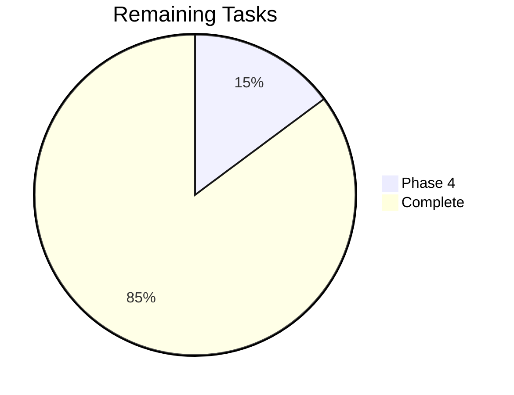

# Tracker — UNION-BANK-: Living Status Tracker

| Field | Value |
| --- | --- |
| Version | v0.1 |
| Last Updated | 2026-08-06 |
| Owner | Tech Lead |
| Status | Active |

---

## 1. Snapshot Dashboard

| Metric | Value |
| --- | --- |
| Overall % Complete | 85% |
| Current Phase | Phase 4 — Hardening |
| Tasks Done / Total | 23 / 27 |
| Blockers (open) | 1 (R-01 pybreaker local env) |
| Days to Target (80% coverage) | 60 |

## 2. Status Legend

🟢 Done | 🟡 In Progress | 🔴 Blocked | ⚪ Not Started | 🔵 In Review

## 3. Phase Progress Bars

| Phase | Progress |
| --- | --- |
| Phase 0 — Canonical Tree | [██████████] 100% |
| Phase 1 — Core Banking | [██████████] 100% |
| Phase 2 — Scale & Async | [██████████] 100% |
| Phase 3 — Ops | [██████████] 100% |
| Phase 4 — Hardening | [██░░░░░░░░] 20% |

## 4. Full Task Table

| TASK | Description | Status | Assignee | Start | Target | Actual | Notes |
| --- | --- | --- | --- | --- | --- | --- | --- |
| TASK-0.1 | Forensic inventory | 🟢 | Owner | 06-01 | 06-03 | 06-03 | [INVENTORY.md](../reference/INVENTORY.md) |
| TASK-0.2 | Delete dead code | 🟢 | Owner | 06-04 | 06-05 | 06-04 | 0 dup modules |
| TASK-0.3 | Service consolidation | 🟢 | Owner | 06-05 | 06-06 | 06-06 | ADR-0001 |
| TASK-1.1 | begin_nested() transfer | 🟢 | Owner | 06-08 | 06-10 | 06-09 | — |
| TASK-1.2 | Fault-injection crash test | 🟢 | Owner | 06-10 | 06-12 | 06-11 | Proves atomicity |
| TASK-1.3 | Concurrency conservation | 🟢 | Owner | 06-12 | 06-13 | 06-12 | 10 transfers |
| TASK-1.4 | Security hardening | 🟢 | Owner | 06-13 | 06-19 | 06-18 | ADR-0002 |
| TASK-1.5 | 2FA completion | 🟢 | Owner | 06-19 | 06-21 | 06-20 | ADR-0003 |
| TASK-1.6 | Rate limiting + lockout | 🟢 | Owner | 06-21 | 06-23 | 06-22 | — |
| TASK-2.1 | Async SQLAlchemy | 🟢 | Owner | 06-25 | 06-28 | 06-27 | — |
| TASK-2.2 | Protocol-based DI | 🟢 | Owner | 06-28 | 06-30 | 06-29 | — |
| TASK-2.3 | Cursor pagination | 🟢 | Owner | 06-30 | 07-02 | 07-01 | 10k accounts |
| TASK-2.4 | Redis cache | 🟢 | Owner | 07-02 | 07-04 | 07-03 | 60s TTL |
| TASK-2.5 | Alembic migrations | 🟢 | Owner | 07-04 | 07-07 | 07-06 | ADR-0005 |
| TASK-3.1 | Prometheus metrics | 🟢 | Owner | 07-10 | 07-12 | 07-11 | — |
| TASK-3.2 | JSON logging | 🟢 | Owner | 07-12 | 07-13 | 07-12 | bank.jsonl |
| TASK-3.3 | Probes | 🟢 | Owner | 07-13 | 07-14 | 07-13 | /health /ready |
| TASK-3.4 | Grafana + K8s | 🟢 | Owner | 07-14 | 07-17 | 07-16 | — |
| TASK-3.5 | React SPA + Vitest | 🟢 | Owner | 07-17 | 07-24 | 07-22 | 10 FE tests |
| TASK-4.1 | Fix pybreaker local gap | 🔴 | Owner | 08-10 | 08-11 | — | Missing from local env; CI OK |
| TASK-4.2 | Coverage 73→80% | ⚪ | Owner | 08-12 | 09-15 | — | — |
| TASK-4.3 | TLA+ spec (explore) | ⚪ | Owner | 10-01 | 12-01 | — | OQ-01 |
| TASK-4.4 | Read-replica DI config | ⚪ | Owner | 10-01 | 11-01 | — | OQ-02 |

## 5. Blockers Log

| ID | Description | Raised | Owner | Impact | Status |
| --- | --- | --- | --- | --- | --- |
| R-01 | `pybreaker` module missing locally → 3 test modules fail import (test_analyzr, test_api_integration, test_integration) | 2026-08-06 | Owner | Local test runs blocked until install | Open — add to requirements + reinstall |

## 6. Changelog

- 2026-08-06: **Documentation suite complete** — 14-file suite consolidated into `docs/`, categorized structure, cross-linked navigation, deployment/git/auth diagrams, quality gate passed (238/238), merged to `main`.
- 2026-08-06: Documentation suite generated (14 files); R-01 blocker logged.
- 2026-07-22: React SPA + 10 frontend tests shipped.
- 2026-07-16: Grafana + K8s manifests shipped.
- 2026-06-22: Lockout + rate limiting shipped.
- 2026-06-20: TOTP 2FA enforced on admin login.
- 2026-06-11: Crash-mid-transfer test proven.
- Audit history: 3.8/10 → 8.1/10 (SELF_AUDIT.md).

## 7. Burndown Summary

## 8. Next 3 Priorities

1. TASK-4.1 — add `pybreaker` to requirements + reinstall to clear R-01.
2. TASK-4.2 — raise coverage 73% → 80%.
3. TASK-4.3 — explore TLA+ atomicity spec (OQ-01).

## 9. Related Documents

| Document | Relationship |
| --- | --- |
| [ImplementationPlan.md](ImplementationPlan.md) | Task source |
| [PRD.md](../product/PRD.md) | Feature status |
| [RiskRegister.md](RiskRegister.md) | R-01 detail |
