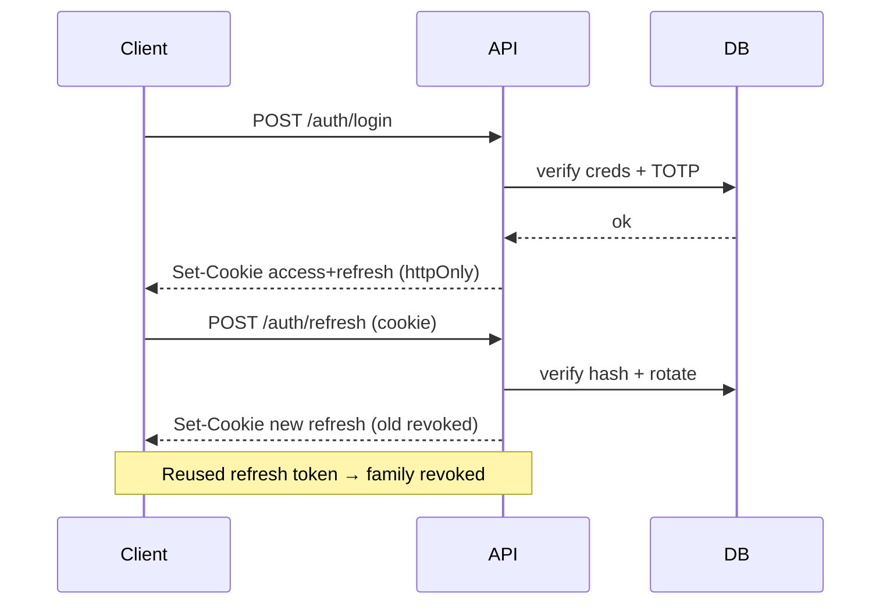

# API — UNION-BANK-: API Reference (v1 + v2)

| Field | Value |
| --- | --- |
| Version | v0.1 |
| Last Updated | 2026-08-06 |
| Owner | Backend Engineer |
| Status | Approved |

Base URL (dev): `http://localhost:8000`. Versioning: `/api/v1/` (legacy, deprecated) + `/api/v2/` (current, envelope `ApiResponse[T]`).

## 1. Endpoint Summary (v2)

| Method | Path | Auth | Purpose |
| --- | --- | --- | --- |
| POST | /api/v2/auth/register | N | Create user |
| POST | /api/v2/auth/login | N | Login (password + TOTP) |
| POST | /api/v2/auth/refresh | Cookie | Rotate refresh token |
| POST | /api/v2/auth/logout | Cookie | Revoke session |
| GET | /api/v2/auth/me | JWT | Current user |
| POST | /api/v2/auth/2fa/enroll | JWT | Start TOTP enrollment |
| POST | /api/v2/auth/2fa/confirm | JWT | Confirm enrollment |
| GET | /api/v2/accounts | JWT | List accounts |
| GET | /api/v2/accounts/{id} | JWT | Account detail |
| POST | /api/v2/accounts | JWT | Open account |
| POST | /api/v2/transfers | JWT + CSRF | Transfer money |
| POST | /api/v2/deposits | JWT + CSRF | Deposit |
| POST | /api/v2/withdrawals | JWT + CSRF | Withdraw |
| GET | /api/v2/transactions | JWT | Cursor-paginated history |
| GET | /api/v2/loans | JWT | List loans |
| POST | /api/v2/loans | JWT + CSRF | Apply for loan |
| GET | /api/v2/admin/stats | JWT admin + 2FA | Cached stats |
| GET | /health | N | Liveness |
| GET | /ready | N | Readiness (DB + cache) |
| GET | /metrics | N | Prometheus |

## 2. Auth

- **Access:** RS256 JWT, 15 min TTL, delivered via httpOnly, Secure, SameSite=Strict cookie.
- **Refresh:** 7-day rotating, bcrypt-hashed in DB, reused token → revoke family.
- **2FA:** TOTP via pyotp; enforced for admin login.
- **CSRF:** double-submit — state-changing requests need `X-CSRF-Token` header matching cookie.
- **Rate limits:** IP-based (slowapi) all endpoints; account-based 5 money-movements/hour.
- **Lockout:** 5 failed attempts → 15-min freeze.

## 3. Envelope Contract (v2)

```json
{ "success": true, "data": { ... }, "error": null }
// error shape: { "code": "E409_INSUFFICIENT_FUNDS", "message": "...", "details": {} }
```

## 4. Endpoint Details

### POST /api/v2/transfers

**Request**

```json
{ "from_account_id": "a1", "to_account_id": "a2", "amount": 250.00, "idempotency_key": "k-123" }
```

**Response 200**

```json
{ "success": true, "data": { "transaction_id": "t1", "status": "completed" }, "error": null }
```

| Code | Meaning |
| --- | --- |
| 200 | Completed (atomic) |
| 400 | E400_VALIDATION — bad input |
| 403 | E403_CSRF — missing/mismatched token |
| 404 | E404_ACCOUNT — account not found |
| 409 | E409_INSUFFICIENT_FUNDS / E409_IDEMPOTENCY |
| 429 | E429_RATE_LIMIT — > 5 money ops/hr |
| 401 | E401_UNAUTHORIZED — expired/invalid token |

### GET /api/v2/transactions

**Response 200 (cursor paginated)**

```json
{ "success": true, "data": { "items": [ { "id": "t1", "type": "transfer", "amount": 250.00, "status": "completed", "created_at": "..." } ], "next_cursor": "eyJ..." }, "error": null }
```

### POST /api/v2/auth/login

```json
// request
{ "email": "ada@example.com", "password": "s3cret!", "totp": "123456" }
// 200: Set-Cookie (access + refresh), body: user envelope
```

## 5. Auth Flow (sequence)



## 6. Versioning & Deprecation

- `/api/v1/` legacy served with `Deprecation` header; removal only after v2 parity + ≥ 3-month notice.
- Additive changes: minor in v2. Breaking: new major (`/api/v3`).
- Full OpenAPI at `/docs` (Swagger) and `/openapi.json` (schemathesis target).

## 7. Related Documents

| Document | Relationship |
| --- | --- |
| [TechSpec.md](TechSpec.md) | Implementation |
| [Schema.md](Schema.md) | Table mapping |
| [SecurityAndCompliance.md](SecurityAndCompliance.md) | Auth/CSRF policy |
| [Testing.md](Testing.md) | schemathesis fuzz + contract tests |
