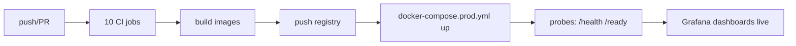

# Deployment — UNION-BANK-: Deployment Guide

| Field | Value |
| --- | --- |
| Version | v0.1 |
| Last Updated | 2026-08-06 |
| Owner | DevOps Engineer |
| Status | Approved |

---

## 1. CI/CD Pipeline



## 2. Environment Promotion

| Stage | Trigger | Verification |
| --- | --- | --- |
| Dev | manual | uvicorn + vite |
| CI | PR/merge | 10 jobs + coverage |
| Prod demo | docker-compose.prod.yml | probes + demo creds |

## 3. Deployment Topology

```mermaid
graph TD
    LB[Ingress/nginx] --> API[API container :8000]
    LB --> FE[React SPA :80 (served/CORS)]
    API --> DB[(PostgreSQL 16)]
    API --> R[(Redis 7.2)]
    PROM[Prometheus] -.scrape.-> API
    GRAF[Grafana] --> PROM
    LOG[(bank.jsonl volume)] -.-> API
    K8S[Kubernetes manifests] --> API
```

- Backend: `uvicorn unionbank.entrypoints.api.main:app`.
- Frontend: Vite build served statically; Axios cookie+CSRF against API.
- Probes: liveness `/health`, readiness `/ready` (DB + Redis check).
- Observability: Prometheus scrapes `/metrics`; Grafana dashboard; JSON logs to volume.

## 4. Rollback Procedure

1. Identify bad release (metrics alert / failing probes).
2. Redeploy previous image tag (immutable tags).
3. If schema changed: Alembic downgrade (round-trip tested).
4. Verify money-conservation invariant on sampled data.
5. Log rollback in ../project/Tracker.md changelog.

## 5. Feature Flag Policy

- No flags in v1 — versioned API + DI config replace flags.
- Rollout of v2 features staged behind endpoint version, not flags.

## 6. On-Call / Runbook — docs/../reference/RUNBOOK.md

- **5xx spike** → check DB/Redis health, deploy history.
- **Auth failures spike** → check lockouts/rate limits; token version bump.
- **Cache hit ratio drop** → verify invalidate-on-write wiring.
- **Breaker open on notifications** → notifications degraded, transfers unaffected.
- **High write contention** → SQLite→PostgreSQL path (ADR-0005).

## 7. Related Documents

| Document | Relationship |
| --- | --- |
| [TechSpec.md](TechSpec.md) | Environments matrix |
| [API.md](API.md) | Probe endpoints |
| [SecurityAndCompliance.md](SecurityAndCompliance.md) | Incident response |
| [ImplementationPlan.md](../project/ImplementationPlan.md) | TASK-3.x |
