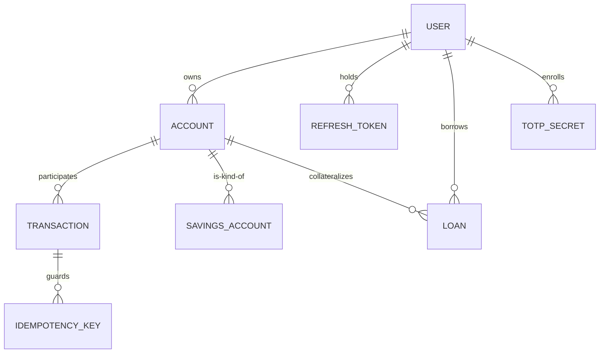

# Schema — UNION-BANK-: Data Model & Database Design

| Field | Value |
| --- | --- |
| Version | v0.1 |
| Last Updated | 2026-08-06 |
| Owner | Data Engineer |
| Status | Approved |

---

## 1. ER Diagram



## 2. Table/Collection Definitions

### TBL-user

| Field | Type | Nullable | Default | Constraints | Description |
| --- | --- | --- | --- | --- | --- |
| id | UUID | N | — | PK | User identifier |
| email | string | N | — | unique | Login email |
| password_hash | string | N | — | bcrypt/argon2 | Credential hash |
| role | enum | N | "customer" | customer/admin | Access role |
| token_version | int | N | 0 | ≥ 0 | Invalidates tokens on change |
| failed_attempts | int | N | 0 | 0..5 | Lockout counter |
| locked_until | datetime | Y | null | — | 15-min freeze window |
| created_at | datetime | N | now() | — | Signup time |

### TBL-account

| Field | Type | Nullable | Default | Constraints | Description |
| --- | --- | --- | --- | --- | --- |
| id | UUID | N | — | PK | Account id |
| user_id | UUID | N | — | FK → TBL-user | Owner |
| account_number | string | N | — | unique | Public identifier |
| account_type | enum | N | "checking" | checking/savings | Type |
| balance | decimal(18,2) | N | 0 | ≥ 0 CHECK | Current balance |
| status | enum | N | "active" | active/frozen/closed | State |
| version | int | N | 0 | ≥ 0 | Optimistic locking |
| created_at | datetime | N | now() | — | Creation |

### TBL-transaction

| Field | Type | Nullable | Default | Constraints | Description |
| --- | --- | --- | --- | --- | --- |
| id | UUID | N | — | PK | Transaction id |
| from_account_id | UUID | Y | null | FK → TBL-account | Sender (null = deposit) |
| to_account_id | UUID | Y | null | FK → TBL-account | Receiver (null = withdraw) |
| amount | decimal(18,2) | N | — | > 0 CHECK | Amount |
| type | enum | N | "transfer" | transfer/deposit/withdraw | Operation |
| status | enum | N | "completed" | completed/failed/rolled_back | Outcome |
| idempotency_key | string | Y | null | unique | Dedupe (ADR-0004) |
| created_at | datetime | N | now() | — | Timestamp |

### TBL-refresh_token

| Field | Type | Nullable | Default | Constraints | Description |
| --- | --- | --- | --- | --- | --- |
| id | UUID | N | — | PK | Token id |
| user_id | UUID | N | — | FK → TBL-user | Owner |
| token_hash | string | N | — | bcrypt hash | Stored hash only |
| family | string | N | — | — | Rotation family |
| expires_at | datetime | N | — | 7 days | Expiry |
| revoked_at | datetime | Y | null | — | Rotation/revoke time |

### TBL-totp_secret

| Field | Type | Nullable | Default | Constraints | Description |
| --- | --- | --- | --- | --- | --- |
| id | UUID | N | — | PK | Secret row |
| user_id | UUID | N | — | FK → TBL-user | Owner (unique) |
| secret | string | N | — | base32 | TOTP seed |
| confirmed_at | datetime | Y | null | — | Enrollment complete |

### TBL-savings_account

| Field | Type | Nullable | Default | Constraints | Description |
| --- | --- | --- | --- | --- | --- |
| id | UUID | N | — | PK | Row id |
| account_id | UUID | N | — | FK → TBL-account | Parent |
| interest_rate | decimal(5,4) | N | 0.0300 | > 0 | APR |
| last_interest_applied | date | N | today() | — | Accrual checkpoint |

### TBL-loan

| Field | Type | Nullable | Default | Constraints | Description |
| --- | --- | --- | --- | --- | --- |
| id | UUID | N | — | PK | Loan id |
| user_id | UUID | N | — | FK → TBL-user | Borrower |
| principal | decimal(18,2) | N | — | > 0 | Amount |
| interest_rate | decimal(5,4) | N | — | > 0 | APR |
| term_months | int | N | — | 1..360 | Term |
| status | enum | N | "active" | active/paid/closed | State |
| created_at | datetime | N | now() | — | Origination |

## 3. Relationships & Foreign Keys

| From | To | Type | On Delete | Justification |
| --- | --- | --- | --- | --- |
| TBL-account.user_id | TBL-user | N:1 | Restrict | Never orphan balances |
| TBL-transaction.from/to | TBL-account | N:1 | Restrict | Financial audit trail |
| TBL-refresh_token.user_id | TBL-user | N:1 | Cascade | Tokens die with user |
| TBL-totp_secret.user_id | TBL-user | 1:1 | Cascade | 2FA reset with account |
| TBL-savings_account.account_id | TBL-account | 1:1 | Cascade | Kind-of relationship |
| TBL-loan.user_id | TBL-user | N:1 | Restrict | Keep loan history |

## 4. Indexes

| Table | Index | Columns | Type | Reason |
| --- | --- | --- | --- | --- |
| TBL-transaction | ix_tx_created | created_at | btree | History pagination |
| TBL-transaction | ix_tx_accounts | from_account_id, to_account_id | composite | Account queries |
| TBL-transaction | ix_tx_idem | idempotency_key | unique | Dedupe |
| TBL-refresh_token | ix_rt_user | user_id | btree | Rotation lookup |
| TBL-user | ix_user_email | email | unique | Login |

## 5. Enums / Constants

| Field | Allowed Values |
| --- | --- |
| user.role | customer, admin |
| account.type | checking, savings |
| account.status | active, frozen, closed |
| transaction.type | transfer, deposit, withdraw |
| transaction.status | completed, failed, rolled_back |
| loan.status | active, paid, closed |
| LOCKOUT_THRESHOLD | 5 attempts |
| LOCKOUT_MINUTES | 15 |
| MONEY_OPS_PER_HOUR | 5 (account rate limit) |
| REFRESH_TTL_DAYS | 7 |

## 6. Data Lifecycle

- Retention: financial records retained indefinitely (audit); refresh tokens purged after expiry + 30 days.
- Deletion: accounts soft-frozen before close; hard delete only for unpopulated test rows.
- ADR-0004 governs retention + idempotency.

## 7. Migrations Strategy

- Alembic; SQLite dev ↔ PostgreSQL prod; 5 round-trip migration tests (upgrade/downgrade).
- Naming `NNNN_short_desc`; every migration shipped with its PR + Schema.md update.

## 8. Sample Records

```json
{
  "user": { "id": "u1", "email": "ada@example.com", "role": "customer", "token_version": 1 },
  "account": { "id": "a1", "user_id": "u1", "account_number": "UB-100-0001", "balance": 12480.00, "version": 3 },
  "transaction": { "id": "t1", "from_account_id": "a1", "to_account_id": "a2", "amount": 250.00, "type": "transfer", "status": "completed" },
  "refresh_token": { "id": "r1", "user_id": "u1", "family": "f1", "expires_at": "2026-08-13T10:00:00Z" }
}
```

## 9. Data Validation Rules

| Field | Enforced In | Rule |
| --- | --- | --- |
| account.balance | DB CHECK + App | ≥ 0 |
| transaction.amount | DB CHECK + App | > 0 |
| email | App + DB unique | Valid format |
| refresh token reuse | App | Rotation → revoke family |
| transfer sufficiency | App | Insufficient funds → 400 |

## 10. Sensitive Data Map

| Field | Sensitivity | Encrypt at Rest | Mask Logs |
| --- | --- | --- | --- |
| user.email | PII | Yes | Yes |
| password_hash | Credential | Hashed | N/A |
| totp secret | Credential | Yes | Never logged |
| refresh token hash | Credential | Hashed | Never logged |
| account.balance | Financial | Yes (volume) | Mask in admin logs |
| transactions | Financial | Yes (volume) | Partial (amounts shown per role) |

## 11. Related Documents

| Document | Relationship |
| --- | --- |
| [API.md](API.md) | Endpoints per table |
| [TechSpec.md](TechSpec.md) | DB engine/Alembic |
| [SecurityAndCompliance.md](SecurityAndCompliance.md) | PII/credential handling |
| [Testing.md](Testing.md) | Migration round-trip tests |
