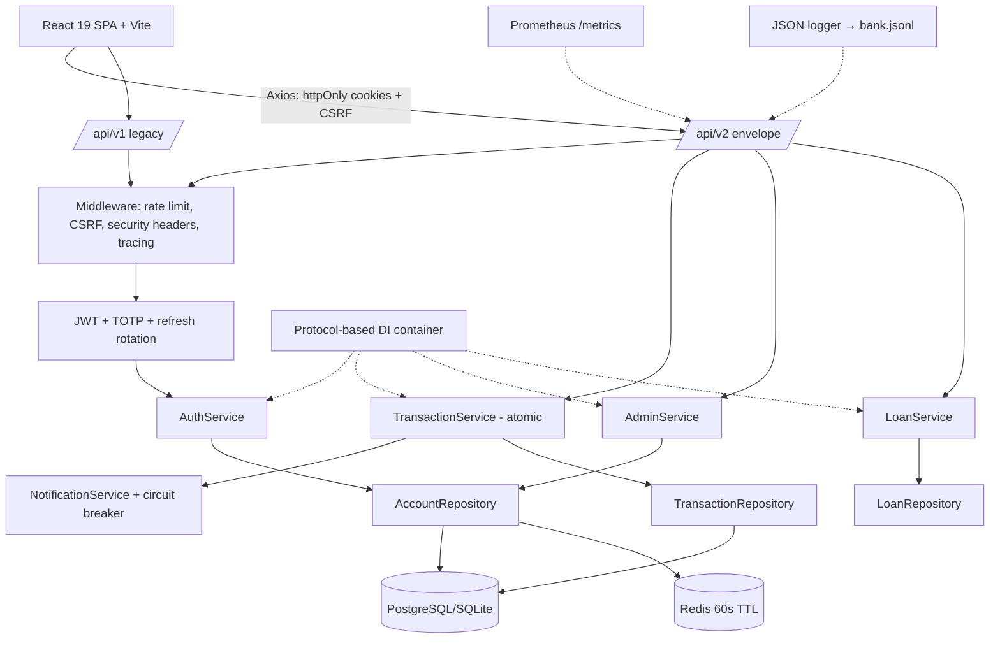
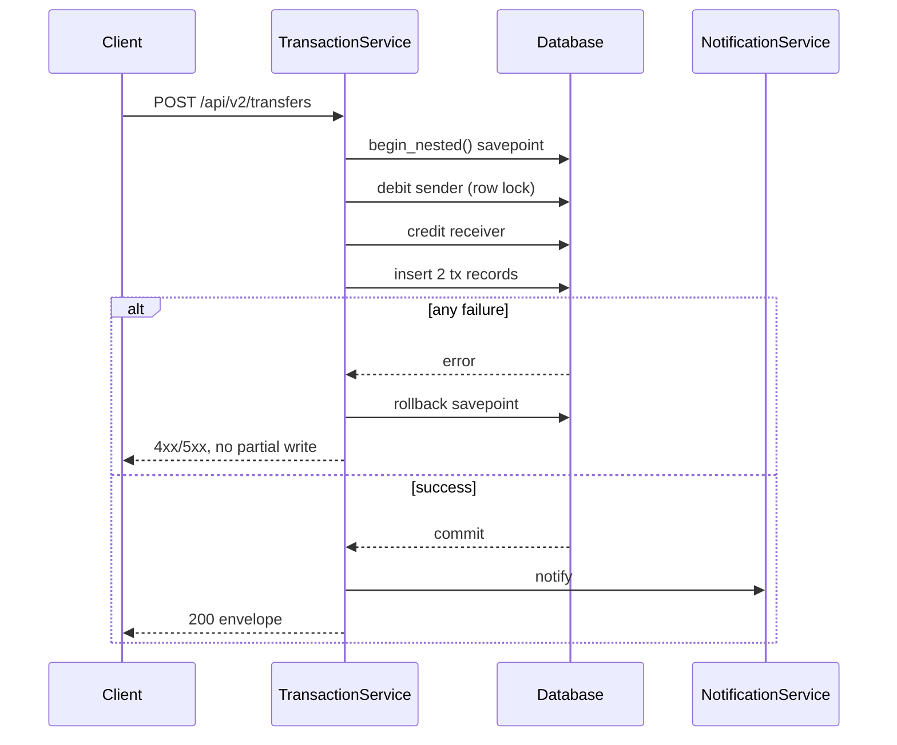
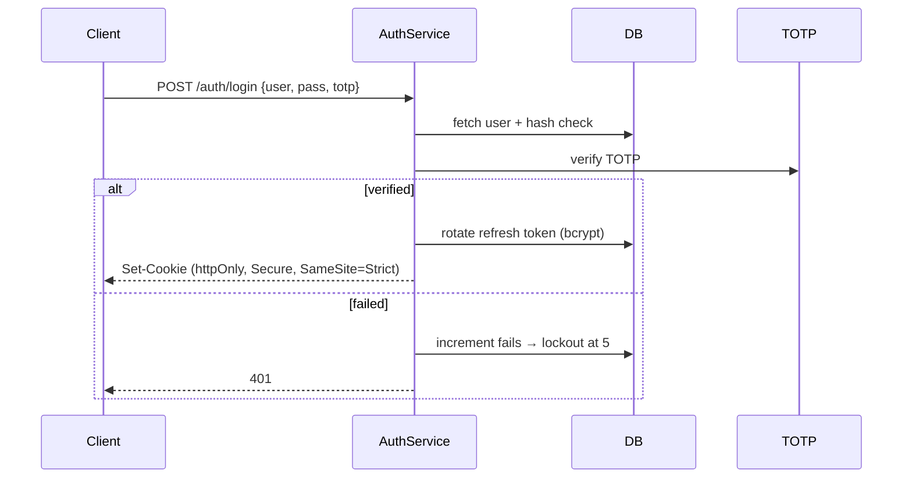
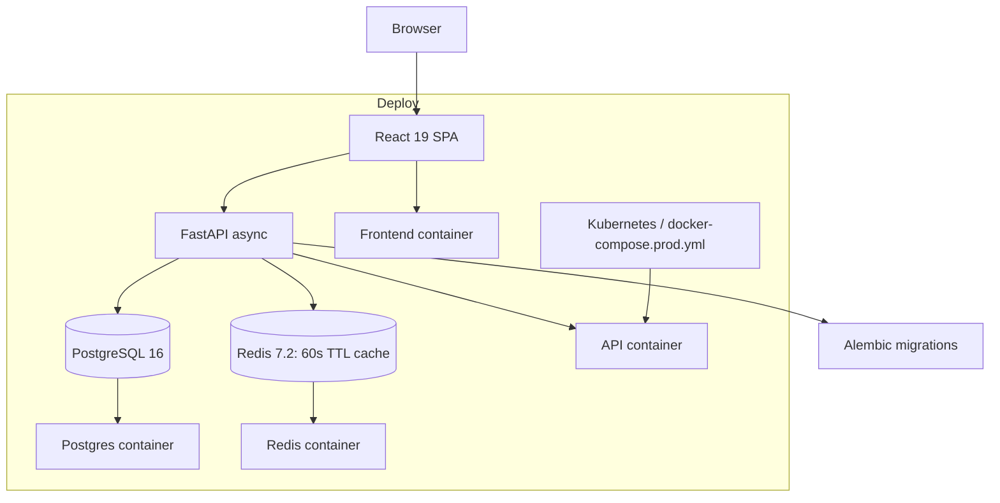

# TechSpec — UNION-BANK-: Technical Specification

| Field | Value |
| --- | --- |
| Version | v0.1 |
| Last Updated | 2026-08-06 |
| Owner | Staff Engineer |
| Status | Approved |

---

## 1. Architecture Overview

## 2. Tech Stack Table

| Layer | Technology | Version | Justification |
| --- | --- | --- | --- |
| API | FastAPI | ≥ 0.135 | Async, typed, OpenAPI-native |
| ORM | SQLAlchemy 2.0 (async) | 2.0+ | begin_nested() savepoints, async hot paths |
| DB | PostgreSQL 16 / SQLite | 16 / 3.x | Local dev → prod evolution via Alembic |
| Cache | Redis | 7.2 | 60s TTL + invalidate-on-write |
| Frontend | React 19 + Vite + Axios | 19 | SPA with cookie/CSRF client |
| Auth | RS256 JWT + pyotp TOTP | — | Defense-in-depth |
| Migrations | Alembic | — | SQLite→PostgreSQL round-trip tested |
| Observability | Prometheus + JSON logging + Grafana | — | /metrics, /health, /ready |
| Testing | pytest + hypothesis + schemathesis + mutmut + Vitest | — | 386 tests, fuzz, mutation |
| Deploy | Docker + docker-compose + K8s manifests | — | docker-compose.prod.yml |

## 3. System Components

| Component | Responsibility | Scaling | Failure Modes |
| --- | --- | --- | --- |
| AuthService | Login, 2FA, refresh rotation, lockout | Stateless replicas | DB down → auth unavailable (fails closed) |
| TransactionService | Atomic transfer via begin_nested() | Serialize per account row lock | Crash → savepoint rollback (proven) |
| AdminService | Admin ops, stats, audit | Read-heavy, cached | Cache miss → DB query |
| LoanService | Loan lifecycle | Vertical | Constraint errors surfaced |
| NotificationService | Post-transfer notifications | In-process circuit breaker | Breaker trips → logged, non-fatal |
| Repositories | Data access via protocols | Swappable fakes | — |
| DI Container | Protocol wiring | Config change = impl swap | Miswiring caught by tests |

## 4. Data Flow Diagrams

### 4.1 Atomic Transfer

### 4.2 Login with 2FA

## 5. Third-Party Integrations

| Service | Purpose | Failure Fallback | Cost | Rate Limits |
| --- | --- | --- | --- | --- |
| pyotp | TOTP 2FA | — | Free | N/A |
| slowapi | IP rate limiting | — | Free | Config |
| Prometheus client | Metrics | — | Free | N/A |
| schemathesis | API fuzzing | — | Free | CI-scoped |

## 6. Non-Functional Requirements

| Category | Requirement | Target | How Verified |
| --- | --- | --- | --- |
| Performance | p95 API latency | < 300 ms | Prometheus histogram |
| Reliability | Crash atomicity | 0 partial writes | Fault-injection test |
| Availability | Uptime (prod demo) | ≥ 99.5% | Probes + monitoring |
| Security | Zero known vulns | 0 | CI security jobs |
| Observability | Request coverage | 100% | Structured logs + metrics |
| Scalability | Pagination memory flat | 10k accounts | Cursor pagination test |

## 7. Environments

| Env | URL Pattern | Data | Deploy | Access |
| --- | --- | --- | --- | --- |
| Dev | localhost:8000 / :5173 | SQLite + seed | uvicorn + vite | Local |
| Test/CI | ephemeral | SQLite/Postgres containers | CI 10 jobs | CI |
| Prod demo | docker-compose.prod.yml | PostgreSQL | compose up | Demo creds |

## 8. Error Handling Strategy

- Envelope API: `ApiResponse[T]` with error codes; v1 legacy returns raw.
- Bare `except: pass` banned by CI grep — all errors logged with context.
- Idempotency keys per ADR-0004; retry-safe transfers.
- Circuit breaker on notifications; failure is non-fatal to transfer.
- Account lockout + rate limits bound abuse paths.

## 9. Observability

- Prometheus: request rate, error rate, p95 latency, cache hit ratio.
- Structured JSON logs → bank.jsonl with request id + actor context.
- /health (liveness), /ready (readiness: DB + cache).
- Grafana dashboard + K8s manifests for prod topology.

## 10. Technical Risks & Mitigations

| Risk | Mitigation |
| --- | --- |
| SQLite write serialization | Documented PostgreSQL path (ADR-0005) |
| Dependency gaps in local env | requirements-lock.txt + reinstall (see Tracker R-01) |
| Coverage erosion | Coverage gate + mutation testing (mutmut) |
| API drift v1/v2 | Envelope v2 + deprecation headers + contract tests |
| Token theft | httpOnly + rotation + bcrypt-hashed refresh |

## Deployment Topology

## 11. Related Documents

| Document | Relationship |
| --- | --- |
| [PRD.md](../product/PRD.md) | Requirements implemented |
| [Schema.md](Schema.md) | Tables behind repositories |
| [API.md](API.md) | v1/v2 contracts |
| [SecurityAndCompliance.md](SecurityAndCompliance.md) | Security architecture detail |
| [Deployment.md](Deployment.md) | Docker/K8s topology |
| [Testing.md](Testing.md) | Verification strategy |
