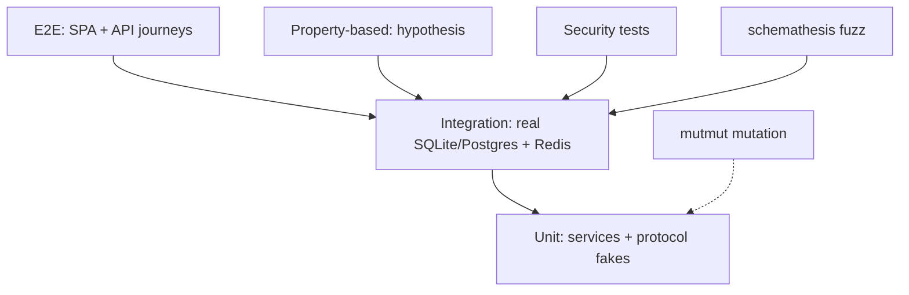

# Testing — UNION-BANK-: Test Strategy

| Field | Value |
| --- | --- |
| Version | v0.1 |
| Last Updated | 2026-08-06 |
| Owner | QA Engineer |
| Status | Approved |

---

## 1. Test Pyramid

## 2. Unit Strategy (protocol fakes, no mocks)

| Area | Cases |
| --- | --- |
| Services | Auth, transfers, loans, admin with fake repos (protocols) |
| Utils | Analyzr natural-language search (53 tests) |
| Validation | Pydantic models, idempotency |

## 3. Integration Strategy

| Area | Cases |
| --- | --- |
| Atomicity | **Crash-mid-transfer fault injection** — kill process, assert no partial write |
| Concurrency | 10 parallel transfers via ThreadPoolExecutor — money conserved |
| Repos+DB | SQLite and PostgreSQL real backends |
| Alembic | 5 upgrade/downgrade round-trips + table verification |
| Cache | Redis TTL + invalidate-on-write |

## 4. Property-Based Tests (hypothesis)

| Invariant | Assertion |
| --- | --- |
| Money conservation | Σbalances constant across random transfers |
| Non-negative balances | Never negative post-op |
| Transfer idempotency | Same key → same result, single record |
| Stateful money machine | Sequence of ops maintains invariants |

## 5. Security Test Families

| Family | Cases |
| --- | --- |
| SQLi | Injection payload fixtures |
| XSS | Script payloads in text fields |
| CSRF | Token omission/mismatch → 403 |
| JWT | Tampered/expired/wrong-signature tokens |
| 2FA | Wrong TOTP, missing enrollment |
| Password leak | No plaintext in logs/errors |
| Rate limit | > 5 money ops/hr → 429 |

## 6. Frontend Tests (Vitest + RTL)

- 10 tests: conditional rendering, loading, error states.
- Axios client sends CSRF header; cookie handling.

## 7. CI Gates (10 jobs)

| Job | Gate |
| --- | --- |
| Backend tests | 376 passing |
| Coverage | ≥ 73% (target 80%) |
| Frontend | Vitest 10 passing |
| Security | All families |
| Mutation (mutmut) | Report |
| Fuzz (schemathesis) | OpenAPI fuzz clean |
| Docker build | Image builds |
| Secrets | No creds |
| Commitlint | Conventional commits |
| Postgres | Migration round-trips |

## 8. Test Data Strategy

- Seeded deterministic fixtures; SQLite for speed, PostgreSQL job for prod-fidelity.
- No real PII; Faker-generated emails.

## 9. Related Documents

| Document | Relationship |
| --- | --- |
| [Rules.md](../project/Rules.md) | Requirements (Section 4) |
| [API.md](API.md) | Contracts under fuzz/contract tests |
| [TechSpec.md](TechSpec.md) | Component test mapping |
| [Tracker.md](../project/Tracker.md) | Test task status |
